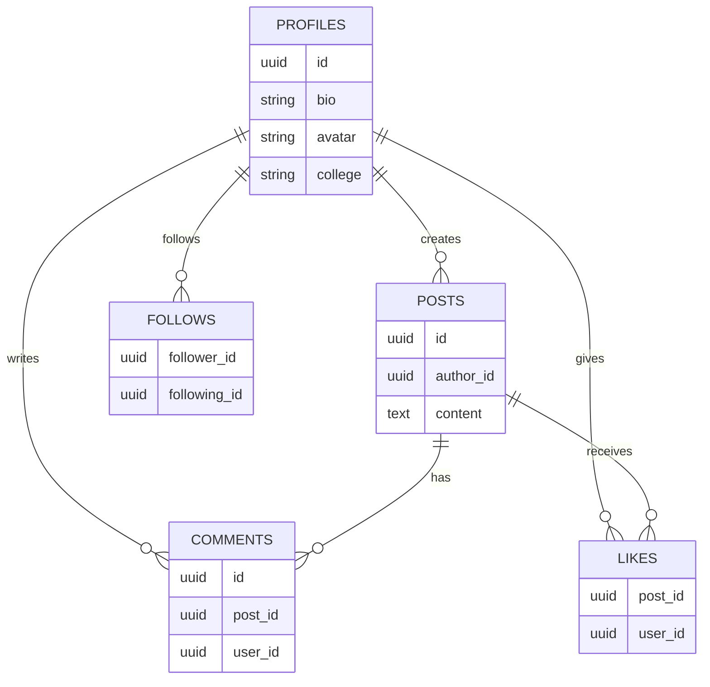
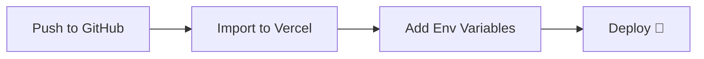

<div align="center">

# 🎓 Campus Hub

### A modern social platform built for college communities

Connect • Share • Engage with your campus, all in one place.


<br/>

[](https://campus-hub-gules.vercel.app)


</div>

---

## ✨ Features

<table>
<tr>
<td width="50%">

### 🔐 Authentication
Secure sign-up/login powered by Supabase Auth with SSR support.

### 📝 Social Feed
Create, view, and interact with posts from your campus community.

### ❤️ Likes
Like and unlike posts in real-time.

### 💬 Comments
Engage in threaded discussions on any post.

</td>
<td width="50%">

### 👥 Follow System
Follow/unfollow users to build your personalized feed.

### 🧑‍🎓 Rich Profiles
Showcase your bio, avatar, and college info.

### 🛡️ Row-Level Security
Database-enforced policies protect every user's data.

### ⚡ Auto Profile Creation
Profiles are generated automatically the moment you sign up.

</td>
</tr>
</table>

---

## 🛠️ Tech Stack

<div align="center">

| Layer | Technology |
|:---:|:---|
| 🖥️ **Framework** | [Next.js 16.2.1](https://nextjs.org/docs) (App Router) |
| ⚛️ **UI Library** | [React 19.2.4](https://react.dev) |
| 🔷 **Language** | TypeScript |
| 🎨 **Styling** | [Tailwind CSS 4](https://tailwindcss.com/docs) + Tailwind Merge |
| 🪄 **Icons** | [Lucide React](https://lucide.dev) |
| 🎬 **Animations** | [Framer Motion](https://www.framer.com/motion) |
| 🗄️ **Backend/DB** | [Supabase](https://supabase.com/docs) (PostgreSQL) |
| 🔑 **Auth** | Supabase Auth (SSR) |
| ☁️ **Deployment** | [Vercel](https://vercel.com/docs) |

</div>

---

## 🚀 Getting Started

### Prerequisites
- Node.js 18+
- npm
- A [Supabase](https://supabase.com) project

### 1️⃣ Clone & Install

```bash
git clone https://github.com/ux-dice/Campus-hub-.git
cd Campus-hub-
npm install
```

### 2️⃣ Configure Environment

Create a `.env.local` file in the root directory:

```env
NEXT_PUBLIC_SUPABASE_URL=your_supabase_project_url
NEXT_PUBLIC_SUPABASE_ANON_KEY=your_supabase_anon_key
```

> 💡 **Tip:** Find these in your Supabase Dashboard under **Settings → API**.

### 3️⃣ Run the Dev Server

```bash
npm run dev
```

Visit **[http://localhost:3000](http://localhost:3000)** 🎉

---

## 📁 Project Structure

```
campus-hub/
├── 📂 app/          # Next.js App Router — pages & components
├── 📂 lib/          # Supabase client setup & TypeScript types
├── 📂 services/     # Business logic (auth, users, posts, comments)
├── 📂 hooks/        # Custom React hooks
└── 📂 public/       # Static assets (images, icons, etc.)
```

---

## 🗄️ Database Schema



All tables are protected with **Row-Level Security (RLS)** policies, ensuring users can only access and modify data they own.

---

## 📜 Available Scripts

| Command | Description |
|---|---|
| `npm run dev` | 🔧 Starts the development server |
| `npm run build` | 📦 Builds the app for production |
| `npm start` | 🚀 Runs the production build |
| `npm run lint` | 🧹 Lints the codebase with ESLint |

---

## ☁️ Deployment

This project is deployed on **Vercel**.



For more details, check the [Next.js deployment docs](https://nextjs.org/docs/app/building-your-application/deploying).

---

## 🤝 Contributing

Contributions are welcome! Here's how:

1. 🍴 Fork the repository
2. 🌱 Create a branch: `git checkout -b feature/your-feature`
3. 💾 Commit changes: `git commit -m 'Add some feature'`
4. 📤 Push: `git push origin feature/your-feature`
5. 🔁 Open a Pull Request

---

## 📄 License

Licensed under the **MIT License**.

---

<div align="center">

Made with ❤️ for campus communities

⭐ **Star this repo if you found it useful!**

</div>
