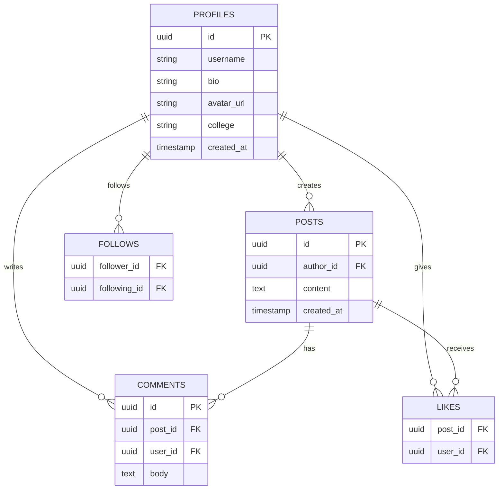
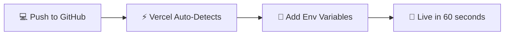

<div align="center">

<!-- ══════════════════════════════════════════════════════════ -->
<!--                     HERO BANNER                            -->
<!-- ══════════════════════════════════════════════════════════ -->


<br/>

<a href="https://git.io/typing-svg">
  
</a>

<br/><br/>

<!-- BADGES -->
<p>
  <a href="https://campus-hub-gules.vercel.app">
    
  </a>
</p>

<p>
  
  
  
  
  
  
</p>

<p>
  
  
  
  
</p>

</div>

---

**🏠 Social Feed**

[](https://campus-hub-gules.vercel.app)

*Replace this with:* ``

</td>
<td align="center" width="50%">

**🧑‍🎓 User Profile**

[](https://campus-hub-gules.vercel.app)

*Replace this with:* ``

</td>
</tr>
<tr>
<td align="center" width="50%">

**🔐 Auth / Login**

[](https://campus-hub-gules.vercel.app)

*Replace this with:* ``

</td>
<td align="center" width="50%">

**📱 Mobile View**

[](https://campus-hub-gules.vercel.app)

*Replace this with:* ``

</td>
</tr>
</table>
</div>

> 💡 **Quick tip:** Use [screely.com](https://screely.com) or [shots.so](https://shots.so) to turn plain screenshots into beautiful mockups for free.

---

## ✨ Features

<table>
<tr>
<td width="50%" valign="top">

### 🔐 Authentication
Secure sign-up/login powered by Supabase Auth with full SSR support. Sessions persist across page refreshes.

### 📝 Social Feed
Create, view, and interact with posts from your campus community in a real-time, scrollable feed.

### ❤️ Likes
Like and unlike posts instantly — real-time updates, no page reload needed.

### 💬 Comments
Threaded discussions on every post. Engage, reply, and build conversations.

</td>
<td width="50%" valign="top">

### 👥 Follow System
Follow and unfollow users to build your own personalized feed and network.

### 🧑‍🎓 Rich Profiles
Showcase your bio, avatar, college name, and activity — all in one place.

### 🛡️ Row-Level Security
Database-enforced RLS policies ensure users can only access and modify their own data.

### ⚡ Auto Profile Creation
Profiles are instantly generated the moment you sign up — zero extra steps.

</td>
</tr>
</table>

---

## 🛠️ Tech Stack

<div align="center">

| Layer | Technology | Purpose |
|:---:|:---|:---|
| 🖥️ **Framework** | [Next.js 16.2.1](https://nextjs.org/docs) (App Router) | Full-stack React framework with SSR |
| ⚛️ **UI Library** | [React 19.2.4](https://react.dev) | Component-based UI |
| 🔷 **Language** | TypeScript | Type-safe development |
| 🎨 **Styling** | [Tailwind CSS 4](https://tailwindcss.com/docs) + Tailwind Merge | Utility-first styling |
| 🪄 **Icons** | [Lucide React](https://lucide.dev) | Clean SVG icon library |
| 🎬 **Animations** | [Framer Motion](https://www.framer.com/motion) | Smooth UI transitions |
| 🗄️ **Backend/DB** | [Supabase](https://supabase.com/docs) (PostgreSQL) | Database + realtime + storage |
| 🔑 **Auth** | Supabase Auth (SSR) | Server-side authentication |
| ☁️ **Deployment** | [Vercel](https://vercel.com/docs) | Zero-config CI/CD deployment |

</div>

---

## 🚀 Getting Started

### Prerequisites
- Node.js 18+
- npm or pnpm
- A [Supabase](https://supabase.com) project (free tier works)

### 1️⃣ Clone & Install

```bash
git clone https://github.com/ux-dice/Campus-hub-.git
cd Campus-hub-
npm install
```

### 2️⃣ Configure Environment

Create a `.env.local` file in the root directory:

```env
NEXT_PUBLIC_SUPABASE_URL=your_supabase_project_url
NEXT_PUBLIC_SUPABASE_ANON_KEY=your_supabase_anon_key
```

> 💡 **Where to find these:** Supabase Dashboard → **Settings → API → Project URL & anon key**

### 3️⃣ Run the Dev Server

```bash
npm run dev
```

Visit **[http://localhost:3000](http://localhost:3000)** 🎉

---

## 📁 Project Structure

```
campus-hub/
├── 📂 app/             # Next.js App Router — pages, layouts & components
│   ├── 📂 (auth)/      # Login, signup pages
│   ├── 📂 feed/        # Social feed page
│   └── 📂 profile/     # User profile pages
├── 📂 lib/             # Supabase client setup & TypeScript types
├── 📂 services/        # Business logic (auth, users, posts, comments)
├── 📂 hooks/           # Custom React hooks
└── 📂 public/          # Static assets
    └── 📂 screenshots/ # ← Put your app screenshots here
```

---

## 🗄️ Database Schema



> All tables are protected with **Row-Level Security (RLS)** policies — users can only read/write data they own.

---

## 📜 Available Scripts

| Command | Description |
|:---|:---|
| `npm run dev` | 🔧 Start development server at `localhost:3000` |
| `npm run build` | 📦 Build production-optimized bundle |
| `npm start` | 🚀 Run the production build |
| `npm run lint` | 🧹 Lint codebase with ESLint |

---

## ☁️ Deployment

Deployed on **Vercel** — push to main, it ships automatically.



**Manual deploy steps:**
1. Import repo at [vercel.com/new](https://vercel.com/new)
2. Add `NEXT_PUBLIC_SUPABASE_URL` and `NEXT_PUBLIC_SUPABASE_ANON_KEY` in environment variables
3. Click **Deploy** — done.

---

## 🤝 Contributing

Contributions are welcome!

1. 🍴 Fork the repo
2. 🌱 Create your branch: `git checkout -b feature/your-feature`
3. 💾 Commit: `git commit -m 'feat: add your feature'`
4. 📤 Push: `git push origin feature/your-feature`
5. 🔁 Open a Pull Request

---

## 📄 License

Licensed under the **[MIT License](./LICENSE)**.

---

<div align="center">


**⭐ Star this repo if you found it useful!**

[🌐 Live Demo](https://campus-hub-gules.vercel.app) · [📁 GitHub](https://github.com/ux-dice/Campus-hub-) · [🐛 Report Bug](https://github.com/ux-dice/Campus-hub-/issues)

</div>
